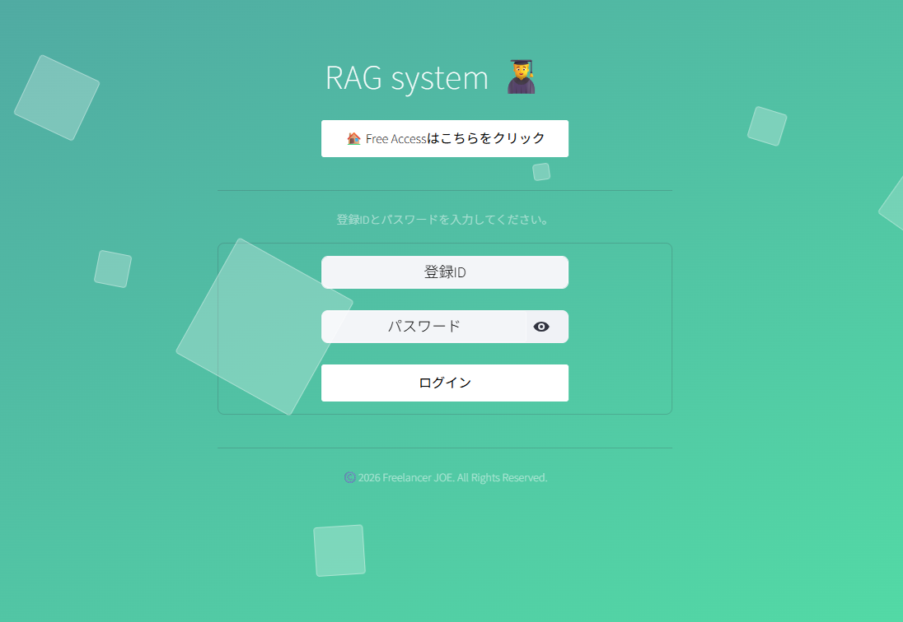

# マルチジャンル RAG 検索・統合認証管理システム

Streamlit および ChromaDB、Ollama、pdf.js を活用した、マルチジャンル対応のローカル RAG（Retrieval-Augmented Generation）検索システムおよび認証・ユーザー管理基盤です。

---

## 📖 目次

1. [概要](#-概要)
2. [画面イメージ](#-画面イメージ)
3. [主な機能](#-主な機能)
4. [システムアーキテクチャ・モジュール構成](#-システムアーキテクチャモジュール構成)
5. [動作環境・依存ライブラリ](#-動作環境依存ライブラリ)
6. [データベース仕様](#-データベース仕様)
7. [セットアップ--起動手順](#-セットアップ--起動手順)
8. [ロール権限管理](#-ロール権限管理)
9. [セキュリティ機能](#-セキュリティ機能)

---

## 💡 概要

本システムは、ドキュメントの種別（Bio、PowerPoint、議事録、規則）に応じて最適なチャンキング手法およびプロンプトを動的に切り替えるローカル RAG 検索機能と、セキュアなユーザー認証・権限管理機能を備えた Web アプリケーションです。

一般ユーザーへの安全な閲覧環境の提供（最小特権の原則）と、管理者による柔軟なドキュメント・ユーザー管理を一元的に実現します。また、回答根拠となる PDF の該当箇所は **pdf.js** を用いてブラウザ上で高精度に表示されます。pages\pdfjsフォルダー内に丸ごとpdf.jsをコピーしてください。

---

## 📸 画面イメージ

### ログイン画面


---

## ✨ 主な機能

### 🔍 RAG ドキュメント検索・生成 (RAG Engine)

* **マルチジャンル対応**:
  * **論文**: 論文翻訳・要約専門プロンプト（`.pdf`）
  * **PowerPoint**: 1スライド＝1チャンク固定（`.pptx`）
  * **議事録**: 議事録特化検索（`.pdf`, `.docx`）
  * **規則**: 条文（第X条、1.1等）による自動スマート分割（`.pdf`）
* **検索 & フィルタリング**: セマンティック検索および除外キーワード（ファイル名部分一致）による絞り込み。
* **PDF ビューア (pdf.js)**: 回答根拠となったページの抽出テキストを **pdf.js** を使用し、インライン表示。
* **回答コピー機能**: 生成された回答のワンクリッククリップボードコピー。

### 🔐 認証・セッション管理 (Authentication)

* **ログイン認証**: `bcrypt` ハッシュ照合および連続失敗によるアカウント自動ロックアウト（5回失敗で10分間ロック）。
* **セッション制御**: 30分間の非アクティブ状態による自動ログアウト・タイマー。
* **アクセス制御 (Guard)**: 権限（admin, user）に応じたアクセス制限とページ間リダイレクト。
* **パスワード変更**: フロント/バックエンドでの強固なポリシーチェック（8文字以上、旧PW照合等）。

### 👥 ユーザー管理ダッシュボード (User Management - Admin Only)

* **アカウント操作**: ユーザーの追加・削除・権限変更・有効/無効化・ロック解除・パスワード強制変更。
* **一括インポート**: Excel ファイル (`.xlsx`) からのユーザー一括登録機能。
* **監査ログ**: 接続元 IP や成否・理由を含むログイン履歴（最新100件）の閲覧・CSV出力・一括消去。

---

## 📂 システムアーキテクチャ・モジュール構成

```
.
├── logon.png             # ログイン画面のイメージ画像
├── init_db.py            # DB初期化・スキーママイグレーション・初期管理者(admin)生成
├── db.py                 # データアクセス層 (SQLite3, bcrypt, 認証・ロックアウト・履歴管理)
├── auth.py               # セッションライフサイクル、セッションタイムアウト監視、共通UI
├── login.py              # ログイン画面 (自動リダイレクト・オフライン環境設定)
├── change_password.py    # パスワード変更画面
├── requirements.txt      # 依存 Python パッケージ一覧
└── pages/
    ├── kanrisya.py       # 【管理者用】RAG登録・削除・検索・pdf.jsハイライト表示
    ├── user.py           # 【一般・理事用】RAG検索・参照専用画面（ファイル操作排除）
    ├── riji.py           # 【理事用】専用ダッシュボード/画面
    └── user_manager.py   # 【管理者用】ユーザー管理・監査ログ・一括インポート画面
```

---

## 🛠️ 動作環境・依存ライブラリ

### システム要求

* **Python**: 3.9+  Python 3.13.9動作確認済
* **データベース**: SQLite3 (標準ライブラリ)
* **ベクトル DB**: ChromaDB (永続化クライアント)
* **LLM エンジン**: Ollama (`granite4.1:8b`)
* **埋め込みモデル**: SentenceTransformers (`intfloat/multilingual-e5-large`)
* **PDF 描画エンジン**: `pdf.js` (PyMuPDF による位置計算後、フロントエンドで埋め込み表示)

### 外部連携ツール (Word -> PDF 変換リレー用)
* Windows 環境: `docx2pdf`
* Linux / Ubuntu 環境: `LibreOffice` (`soffice`)

---

## 🗄️ データベース仕様

`users.db` 内に以下の2つの主要テーブルを自動保持・マイグレーションします。

### 1. `users` テーブル
| カラム名 | 型 | 説明 |
| :--- | :--- | :--- |
| `id` | INTEGER | プライマリキー（自動連番） |
| `username` | TEXT | ユーザー名（UNIQUE） |
| `password_hash` | TEXT | bcrypt ハッシュ化パスワード |
| `role` | TEXT | 権限 (`admin`, `user`) |
| `enabled` | INTEGER | アカウント状態 (1: 有効, 0: 無効) |
| `failed_count` | INTEGER | 連続ログイン失敗回数 |
| `lock_until` | TEXT | ロック解除日時 (`YYYY-MM-DD HH:MM:SS`) |
| `last_login` | TEXT | 最終ログイン日時 |
| `created_at` | TEXT | 作成日時 |

### 2. `login_history` テーブル
| カラム名 | 型 | 説明 |
| :--- | :--- | :--- |
| `id` | INTEGER | 履歴ID |
| `username` | TEXT | 対象ユーザー名 |
| `login_time` | TEXT | 試行日時 |
| `success` | INTEGER | 成功フラグ (1: 成功, 0: 失敗) |
| `ip` | TEXT | 接続元 IP アドレス |
| `user_agent` | TEXT | ブラウザ / クライアント情報 |
| `reason` | TEXT | 失敗・拒否理由 |

---

## 🚀 セットアップ & 起動手順

### 1. 依存ライブラリのインストール

`requirements.txt` を使用して必要な Python パッケージを一括インストールします。

```bash
pip install -r requirements.txt
```

### 2. データベースの初期化

初回のデータベース作成、テーブルマイグレーション、および初期管理者アカウントの登録を行います。

```bash
python init_db.py
```

> **🔑 初期管理者クレデンシャル**:テストDB（users.db）
> * **ユーザー名**: `admin`,`user1`
> * **初期パスワード**: `admin123`,`user123`
> *(※初回ログイン後、速やかにパスワードを変更してください)*

### 3. アプリケーションの起動

```cmd
streamlit run login.py
cd pages
uvicorn pdf_server:app --host 0.0.0.0 --port 8000
```

---

## 🛡️ ロール・権限管理

| ロール | ログイン後遷移先 | RAG ドキュメント操作 | ユーザー管理 |
| :--- | :--- | :--- | :--- |
| **admin** (管理者) | `pages/kanrisya.py` | 登録・削除・検索・閲覧 | 全権限（作成/変更/削除/監査） |
| **user** (一般) | `pages/user.py` | 検索・閲覧のみ | アクセス不可 |

---

## 🔒 セキュリティ機能

1. **最小特権の原則に基づく画面分離**: 一般ユーザー用画面 (`user.py`) からはファイルアップロード・削除ロジックが排除されており、構造的にデータ改ざんやインジェクションを防ぎます。
2. **ブルートフォース攻撃対策**: 連続5回のログイン失敗で10分間のアカウント自動ロックを実施。
3. **セッションタイムアウト**: 30分間操作がない場合、セッションを初期化して自動ログアウト。
4. **安全なパスワード保管**: `bcrypt` によるソルト付きハッシュでデータベースへ保管。
5. **管理者削除保護**: システム内の管理者が残り1名となった場合、アカウント削除を自動的に拒否。

## 📄 ライセンス & 著作権

本プロジェクトは [Apache License 2.0](LICENSE) のもとで公開されています。  
Copyright (c) 2026 Freelancer JOE. All Rights Reserved.